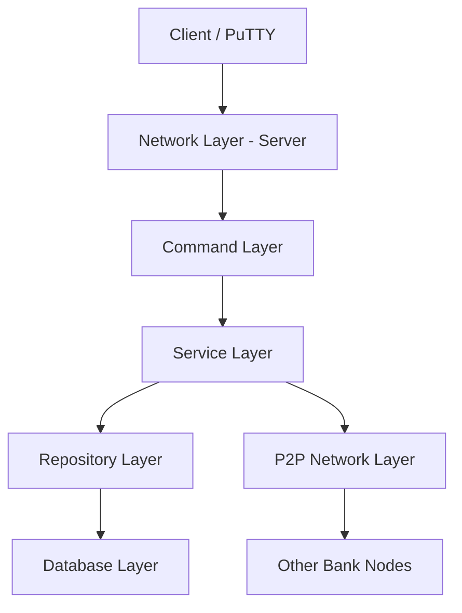
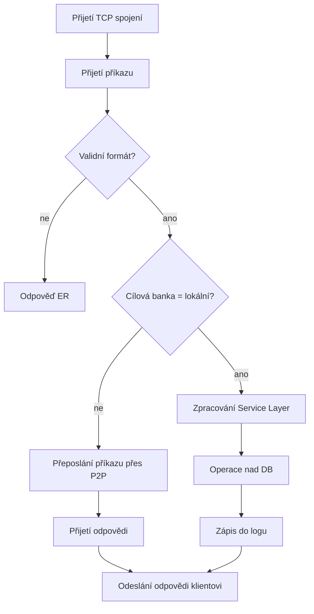
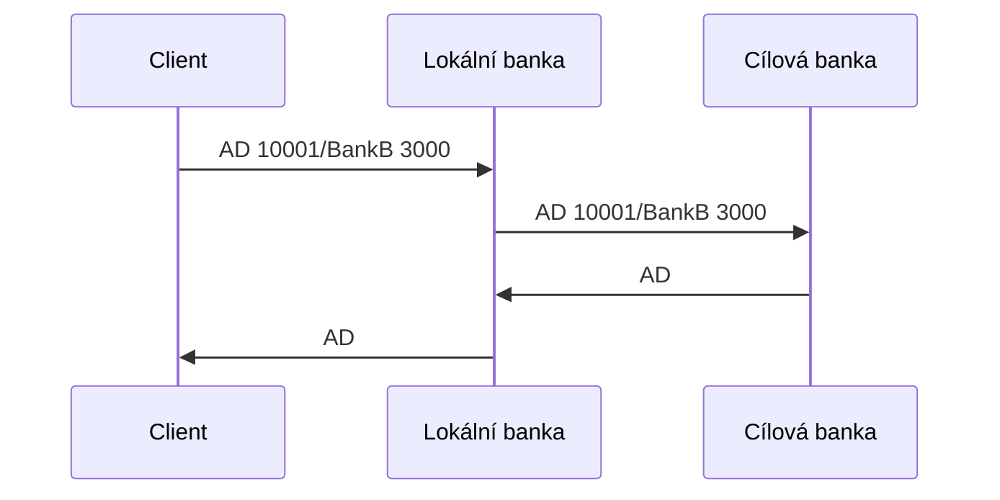

# P2P Bankovní systém
## Základní informace
- **Škola:** SPŠE Ječná
- **Autor:** Sofia Hennelová
- **Datum:** 18.1. 2026

## 1. Úvod
Cílem tohoto školního projektu je vytvořit peer-to-peer (P2P) bankovní systém, kde každý uzel reprezentuje jednu banku.   

Každý uzel je schopen:
- Vytvářet a mazat bankovní účty
- Vkládat a vybírat finanční prostředky
- Kontrolovat zůstatek na účtu
- Zobrazit počet klientů a zůstatek v bance
- Komunikovat s ostatními bankami v síti přes TCP/IP

Aplikace je ovládána ručně pomocí PuTTY nebo telnetu, bez grafického uživatelského rozhraní.  
Komunikace bude probíhat pomocí přesně určených příkazů, které budou zasílný jako text v UTF-8 kódování

## 2. Analýza
### 2.1 Funkční požadavky (Functional Requirements)
- FR1: Banka musí odpovídat na příkaz BC a vracet svou IP adresu jako kód banky.
- FR2: Banka musí umožnit vytvoření bankovního účtu pomocí příkazu AC.
- FR3: Banka musí umožnit vložení peněz na účet pomocí příkazu AD.
- FR4: Banka musí umožnit výběr peněz z účtu pomocí příkazu AW.
- FR5: Banka musí vracet aktuální zůstatek na účtu pomocí příkazu AB.
- FR6: Banka musí umožnit smazání účtu pomocí příkazu AR, pouze pokud je zůstatek účtu 0.
- FR7: Banka musí vracet celkovou částku uloženou ve všech účtech pomocí příkazu BA.
- FR8: Banka musí vracet počet klientů (účtů) pomocí příkazu BN.

Rozšířené funkce (ESSENTIALS BANK NODE)
- FR9: Pokud příkazy AD, AW nebo AB obsahují jiný kód banky (IP adresu), než má aktuální uzel, aplikace se musí připojit na cílovou banku, předat jí příkaz a vrátit odpověď zpět volajícímu.

Pokročilé funkce (HACKER BANK NODE)
- FR10: Banka musí podporovat příkaz RP <number> pouze na vlastním uzlu.
- FR11: Banka musí projít celou P2P síť a zjistit:
  - kolik peněz má každá banka (BA)
  - kolik má klientů (BN)
- FR12: Systém musí navrhnout plán loupeže tak, aby:
  - bylo dosaženo co nejblíže cílové částce
  - bylo okradeno co nejméně klientů
  - bylo možné vyloupit vždy pouze celou banku nebo nic

### 2.2 Ne-funkční požadavky (Non-functional Requirements)
- NFR1: Aplikace musí běžet bez použití IDE.
- NFR2: Aplikace musí naslouchat na TCP portu v rozsahu 65525–65535.
- NFR3: Komunikace probíhá v textovém formátu UTF-8, zprávy jsou jednořádkové.
- NFR4: Každý příkaz musí vrátit odpověď (úspěch nebo ER).
- NFR5: Aplikace musí podporovat více klientů současně (paralelní obsluha).
- NFR6: Aplikace musí mít konfigurovatelný timeout (defaultně 5 sekund).
- NFR7: Aplikace musí logovat svůj provoz i komunikaci s ostatními uzly.
- NFR8: Chybové hlášky musí být srozumitelné a jednoznačné.

## 3. Návrh (Design)
### 3.1 Architektura systému
Aplikace je rozdělena do několika vrstev.

#### 3.1.1 Network Layer - Server
- TCP server naslouchající na konfigurovatelném portu (65525–65535).  
- Zpracovává více klientů paralelně (PuTTY, telnet).  
- Řídí timeouty a správu spojení.  
- Přijímá textové příkazy v UTF-8 a předává je Command Layer.  

#### 3.1.2 P2P Network Layer
- Komunikace s ostatními bankovními uzly v síti.  
- Forwardování příkazů AD, AW, AB na jiné banky (ESSENTIALS).  
- Sběr informací o celkovém zůstatku a počtu klientů pro RP příkaz (HACKER).  

#### 3.1.3 Command Layer
- Přijímá příkazy od klienta (BC, AC, AD, AW, AB, AR, BA, BN, RP).  
- Validuje syntaxi příkazů a správnost parametrů.  
- Volá metody Service Layer a formátuje odpovědi podle protokolu (kódy příkazů nebo ER).  

#### 3.1.4 Service Layer
- Obsahuje **business logiku** banky.  
- Zajišťuje kontrolu zůstatků, limity pro výběry, validace transakcí.  
- Spolupracuje s Repository Layer pro persistentní data.  
- Obsahuje logiku pro plánování loupeže (RP).  

#### 3.1.5 Repository Layer
- Abstrakce nad databází.  
- CRUD operace pro účty a případné transakce.  
- Zajišťuje konzistenci dat a transakční zpracování.  

#### 3.1.6 Database Layer
- Persistentní úložiště dat banky (např. MySQL).  
- Ukládá informace o účtech, zůstatcích a transakcích.  
- Zajišťuje trvalost dat i po restartu aplikace.  
- Podporuje transakce a uzamykání pro vícevláknový přístup.

#### 3.3.1 Diagram vrstev

### 3.2 Použité návrhové vzory

#### Command Pattern
Každý bankovní příkaz (např. `AC`, `AD`, `AW`, `AB`) je implementován jako samostatná třída.  

#### Repository Pattern
Přístup k datům je oddělen od aplikační logiky pomocí repository vrstvy.

### 3.3 Popis příkazů a komunikace
Formát příkazů: `<COMMAND> <account>/<ip> <number>`
- BC = Bank code
  - Vrací kód banky (IP adresu).
  - Příklad: BC → BC 10.1.2.3

- AC = Account create
  - Vytvoří nový účet, odpoví číslem účtu.
  - Příklad: AC → AC 10001/10.1.2.3

- AD = Account deposit
  - Vloží peníze na účet.
  - Příklad: AD 10001/10.1.2.3 3000 → AD

- AW = Account withdrawal
  - Vybere peníze z účtu.
  - Příklad: AW 10001/10.1.2.3 2000 → AW

- AB = Account balance
  - Vrací aktuální zůstatek.
  - Příklad: AB 10001/10.1.2.3 → AB 2000

- AR = Account remove
  - Smaže účet, pouze pokud zůstatek = 0.

- BA = Bank (total) amount
  - Vrací součet všech prostředků v bance.

- BN = Bank number of clients
  - Vrací počet klientů s účtem.

- RP = Robbery plan (HACKER)
  - Pouze na vlastním uzlu.
  - Vytvoří plán loupeže podle P2P sítě.

- ER = Error
  - Vráceno při chybě nebo neplatném příkazu.
 
### 3.4 Databáze
Data o účtech a historii příkazů jsou uložena v relační databázi MySQL.

#### Tabulka `account`
Ukládá základní informace o bankovních účtech.
- `id` – interní primární klíč
- `account_number` – číslo účtu (10000–99999), unikátní v rámci banky
- `balance` – aktuální zůstatek účtu

#### Tabulka `transaction_log`
Slouží pro logování všech příkazů, které banka zpracovala (úspěšných i neúspěšných).
- `id` – primární klíč
- `account_number` – číslo účtu, kterého se příkaz týká (NULL pro BC, BA, BN)
- `command` – kód příkazu (AC, AD, AW, AB, AR, BA, BN, RP)
- `amount` – částka (pouze pro AD a AW)
- `result` – výsledek příkazu (např. úspěch nebo chybová zpráva ER)
- `client_ip` – IP adresa klienta nebo bankovního uzlu
- `timestamp` – čas zpracování příkazu
- `forwarded_to` – IP cílové banky, pokud byl příkaz přeposlán (ESSENTIALS)

### 3.5 Konfigurace
Konfigurace aplikace je řešena pomocí konfiguračního souboru.
- `PORT` – TCP port, na kterém banka naslouchá (65525–65535)
- `TIMEOUT` – časový limit pro síťovou komunikaci (výchozí hodnota 5 sekund)
- `DB_HOST` – adresa databázového serveru
- `DB_PORT` – port databáze
- `DB_NAME` – název databáze
- `DB_USER` – databázový uživatel
- `DB_PASSWORD` – heslo k databázi

### 3.6 Popis běhu aplikace
#### Activity diagram – zpracování příkazu

#### Sequence diagram – vklad na účet v jiné bance (AD)

